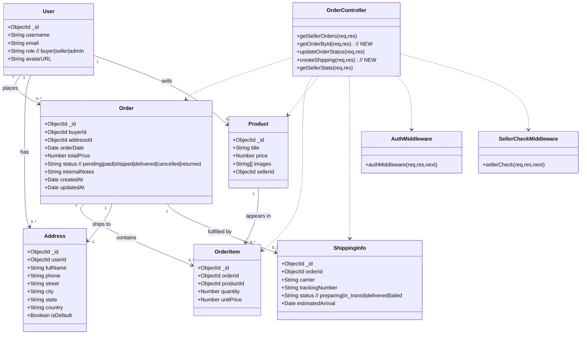
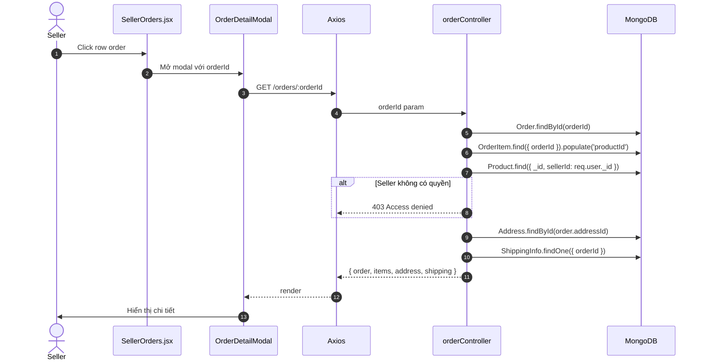
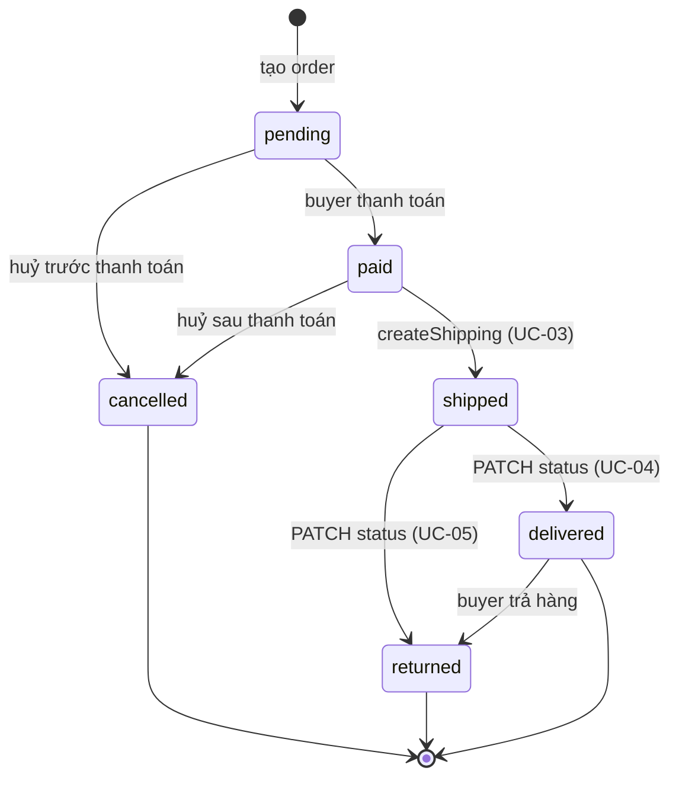

# Order Management - Use Case Spec, Class Diagram, Sequence Diagram

> Phạm vi: Tính năng order cho **Seller** trong hệ thống seller-ebay (eBay clone).
> Stack: Node.js / Express / Mongoose (back-end), React (front-end).
> **Lưu ý quan trọng:** Tài liệu này suy ngược từ code thực tế trong repo (cập nhật sau khi review). Tài liệu cũ đã tham chiếu nhiều đường dẫn/field KHÔNG tồn tại (ví dụ `addTracking`, `getOrderById`, `sellerProfileId`, `tracking` trên Order). Bản này khớp 100% với code.

## Mục lục

1. [Review tài liệu cũ vs code thật](#1-review-tài-liệu-cũ-vs-code-thật)
2. [Đối chiếu eBay Seller flow thật](#2-đối-chiếu-ebay-seller-flow-thật)
3. [Actors & Scope](#3-actors--scope)
4. [Use Case Spec](#4-use-case-spec)
   - UC-01: Xem danh sách đơn hàng
   - UC-02: Xem chi tiết đơn hàng
   - UC-03: Xác nhận đơn hàng & in phiếu vận chuyển giả lập
   - UC-04: Cập nhật giao hàng thành công
   - UC-05: Cập nhật giao hàng thất bại
5. [Hướng dẫn triển khai UI](#5-hướng-dẫn-triển-khai-ui)
6. [Hướng dẫn triển khai Back-end](#6-hướng-dẫn-triển-khai-back-end)
7. [Class Diagram](#7-class-diagram)
8. [Sequence Diagram](#8-sequence-diagram)
9. [State Diagram](#9-state-diagram)
10. [Checklist triển khai](#10-checklist-triển-khai)

---

## 1. Review tài liệu cũ vs code thật

| Mục trong tài liệu cũ | Code thật | Kết luận |
|------------------------|-----------|----------|
| `Order.sellerId`, `Order.buyerName`, `Order.listingTitle`, `Order.tracking`, `Order.pricing` | `Order` chỉ có: `buyerId, addressId, orderDate, totalPrice, status` | **SAI** — nhiều field suy diễn không tồn tại |
| `Order.status` enum: `awaiting_payment, awaiting_shipment, shipped, delivered, returned, refunded, cancelled, delivery_failed` | enum thật: `pending, paid, shipped, delivered, cancelled, returned` | **SAI** — chỉ có 6 status |
| `POST /api/seller/orders/:orderId/tracking` (controller `addTracking`) | Không tồn tại | **SAI** — chưa có endpoint tạo tracking |
| `Order.tracking` (object với carrier, trackingNumber...) | Tracking nằm ở model `ShippingInfo` riêng (`orderId, carrier, trackingNumber, status, estimatedArrival`) | **SAI** — tách model riêng |
| `sellerCheck` middleware ở `back-end/src/middleware/sellerCheck.js:4-37` | Thật ở `server/src/modules/auth/middleware/sellerCheck.js:1-9`, đơn giản, dùng `req.user.role === 'seller'` | **SAI path** |
| `OrderController` có `getOrderById` | Chỉ có 3 method: `getSellerOrders`, `updateOrderStatus`, `getSellerStats` | **SAI** — thiếu method, không có detail endpoint |
| `frontend/src/pages/seller/Orders.js` | UI thật: `ui/src/pages/seller/SellerOrders.jsx` | **SAI path** |
| Status `delivery_failed` | Không tồn tại (chỉ có `returned`) | **SAI** — cần dùng `returned` hoặc mở rộng enum |
| `GET /api/seller/orders/stats` → `getOrderStats` | Thật là `GET /api/v1/orders/stats` → `getSellerStats` | **SAI path** |
| `User.sellerProfileId`, `SellerProfile` | Code thật dùng `User.role = 'seller'`, KHÔNG có `SellerProfile` | **SAI** — check role thay vì profile |

**Tóm lại**: Tài liệu cũ mô tả một hệ thống lý tưởng chưa tồn tại. Plan mới sẽ bám sát code thật.

---

## 2. Đối chiếu eBay Seller flow thật

eBay Seller có các trạng thái đơn hàng và hành động chính (theo tài liệu seller center chính thức):

1. **Awaiting payment** → buyer chưa trả tiền
2. **Awaiting shipment** → buyer đã trả, seller cần gửi hàng. Hành động: Print shipping label, Mark as shipped
3. **Shipped** → seller đã gửi. Tracking được tạo. Buyer có thể xem tracking
4. **Delivered** → hãng vận chuyển báo giao thành công
5. **Cancelled** / **Returned**

Các hành động seller trong từng trạng thái:
- **Awaiting shipment**: 
  - Print shipping label (giả lập) → sinh tracking number → tự động mark shipped
  - Hoặc nhập tracking thủ công → mark shipped
  - Cancel order
- **Shipped**: 
  - Mark as delivered (khi có xác nhận từ hãng/buyer)
  - Contact buyer, refund
- **Bất kỳ lúc nào**: View order detail, contact buyer

**Ánh xạ vào hệ thống hiện tại**:
- `awaiting_payment` ↔ `pending`
- `paid` ↔ `awaiting_shipment` (đã trả tiền, chờ giao)
- `shipped` ↔ `shipped`
- `delivered` ↔ `delivered`
- `cancelled` ↔ `cancelled`
- `returned` ↔ `returned`
- **THIẾU**: `delivery_failed` (hệ thống hiện không có). Giải pháp: dùng `returned` cho delivery fail, hoặc mở rộng enum (Xem thêm ở §9).

---

## 3. Actors & Scope

| Actor | Loại | Quyền |
|-------|------|-------|
| Seller | Primary | Đã đăng nhập, `role === 'seller'` |
| System | Secondary | Tự sinh tracking giả lập khi tạo label |

**Ràng buộc truy cập**:
- **FE**: `/seller/orders` bọc trong `PrivateRoute` + Seller Hub layout.
- **BE**: `router.use(auth, sellerCheck)` ở `server/src/modules/order/routes/orderRoutes.js:7`.

---

## 4. Use Case Spec

### UC-01: Xem danh sách đơn hàng

| Field | Value |
|-------|-------|
| Mã | UC-01 |
| Tên | Xem danh sách đơn hàng |
| Actor | Seller |
| Mục đích | Lấy danh sách đơn có chứa sản phẩm của seller |
| Trigger | Seller mở `/seller/orders` |

**Pre-condition**: Seller đã đăng nhập, `role === 'seller'`.

**Main flow**:
1. FE gọi `GET /api/v1/orders`.
2. BE tìm tất cả `Product` của seller.
3. BE tìm `OrderItem` có `productId` thuộc seller, populate `orderId`, `buyerId`, `addressId`, `productId`.
4. BE gom theo `orderId`, tính `totalPrice` từ `quantity * unitPrice`, trả mảng.

**API**: `GET /api/v1/orders` → `orderController.getSellerOrders` (`server/src/modules/order/controllers/orderController.js:3-51`).

**Hiện trạng UI**: Đã có (`SellerOrders.jsx`), nhưng chỉ hiển thị bảng đơn giản, **chưa có filter/search/date range/pagination** (gap).

---

### UC-02: Xem chi tiết đơn hàng

| Field | Value |
|-------|-------|
| Mã | UC-02 |
| Tên | Xem chi tiết đơn hàng |
| Actor | Seller |

**Hiện trạng**: **CHƯA CÓ endpoint + UI**. Cần triển khai.

**Main flow đề xuất**:
1. Seller click vào 1 dòng order.
2. Mở modal/drawer chi tiết.
3. FE gọi `GET /api/v1/orders/:orderId` (endpoint mới).
4. BE trả về order + items + buyer + address + shippingInfo (nếu có).

**Business rules**: Chỉ trả về nếu seller có product thuộc order đó (giống `getSellerOrders`).

---

### UC-03: Xác nhận đơn hàng & in phiếu vận chuyển giả lập ⭐

| Field | Value |
|-------|-------|
| Mã | UC-03 |
| Tên | Xác nhận đơn hàng & in phiếu vận chuyển giả lập |
| Actor | Seller |
| Mục đích | Sinh thông tin vận chuyển giả lập, lưu `ShippingInfo`, chuyển `Order.status` sang `shipped`, in phiếu |
| Trigger | Seller bấm "Print shipping label" trên đơn `paid` |

**Pre-condition**:
- Order tồn tại, seller có product thuộc order.
- `order.status === 'paid'`.

**Main flow**:
1. FE mở modal chọn **carrier** (USPS, FedEx, UPS, DHL, Giao Hang Nhanh, Vietnam Post, Viettel Post, J&T Express).
2. FE tự sinh giả lập:
   - `trackingNumber = prefix + 12 chữ số ngẫu nhiên`
   - `estimatedArrival = now + 1-5 ngày theo carrier`
3. Seller bấm "Generate Label & Ship".
4. FE gọi `POST /api/v1/orders/:orderId/shipping` với body:
   ```json
   { "carrier": "USPS", "trackingNumber": "US9400111202555555555555", "estimatedArrival": "2026-07-25" }
   ```
5. BE kiểm tra quyền seller với order, status = 'paid'.
6. BE tạo `ShippingInfo { orderId, carrier, trackingNumber, status: 'in_transit', estimatedArrival }`.
7. BE update `Order.status = 'shipped'`.
8. BE trả `{ shipping, order }`.
9. FE dựng phiếu vận chuyển (template USPS-style) với ship-to address, barcode giả lập.
10. Seller bấm **Print Label** → `window.print()` với CSS `@media print`.

**Post-condition**:
- `ShippingInfo` mới với `status: 'in_transit'`.
- `Order.status = 'shipped'`.

**Exception**:
- 403 nếu seller không có product trong order.
- 400 nếu status !== 'paid'.
- 409 nếu đã có ShippingInfo (chỉ cho 1 active label mỗi order).

**API mới cần tạo**:
- `POST /api/v1/orders/:orderId/shipping` → `orderController.createShipping`

---

### UC-04: Cập nhật giao hàng thành công ⭐

| Field | Value |
|-------|-------|
| Mã | UC-04 |
| Tên | Cập nhật giao hàng thành công |
| Actor | Seller |
| Mục đích | Đánh dấu đơn giao thành công |
| Trigger | Có xác nhận từ hãng vận chuyển / buyer xác nhận đã nhận |

**Pre-condition**: `order.status === 'shipped'`.

**Main flow**:
1. FE gọi `PATCH /api/v1/orders/:orderId/status` với body `{ "status": "delivered" }`.
2. BE kiểm tra quyền seller, kiểm tra transition `shipped → delivered`.
3. BE update `Order.status = 'delivered'`.
4. BE update `ShippingInfo.status = 'delivered'` (nếu có).
5. Trả về order.

**Post-condition**: `Order.status = 'delivered'`, `ShippingInfo.status = 'delivered'`.

**API**: `PATCH /api/v1/orders/:orderId/status` → `orderController.updateOrderStatus` (đã có, **cần thêm validate transition**).

**Hiện trạng UI**: `SellerOrders.jsx` đã có dropdown chọn status → có thể chọn `delivered`. **Cần thêm validate ở BE** để chỉ cho `shipped → delivered`.

---

### UC-05: Cập nhật giao hàng thất bại ⭐

| Field | Value |
|-------|-------|
| Mã | UC-05 |
| Tên | Cập nhật giao hàng thất bại |
| Actor | Seller |
| Mục đích | Đánh dấu đơn giao không thành công |
| Trigger | Hãng vận chuyển báo failed / buyer không nhận |

**Hiện trạng vấn đề**: 
- Code hiện KHÔNG có status `delivery_failed`.
- eBay dùng status `returned` cho cả buyer-return và delivery-fail (tuỳ ngữ cảnh).
- **Đề xuất YAGNI**: dùng `returned` + ghi `sellerNotes` cho delivery fail. Mở rộng enum `delivery_failed` sau nếu cần.

**Pre-condition**: `order.status === 'shipped'`.

**Main flow**:
1. FE mở modal nhập lý do fail.
2. FE gọi `PATCH /api/v1/orders/:orderId/status` với body:
   ```json
   { "status": "returned", "sellerNotes": "Lý do fail..." }
   ```
3. BE validate transition + lưu `sellerNotes`.
4. BE update `ShippingInfo.status = 'failed'` (nếu có).
5. Trả về order.

**Vấn đề cần giải quyết**: Hiện `Order` KHÔNG có field `sellerNotes`. Cần:
- **Option A (YAGNI)**: Bỏ field `sellerNotes`, dùng `ReturnRequest.reason` (model `ReturnRequest` đã có).
- **Option B**: Thêm `sellerNotes: String` vào `Order` schema.
- **Khuyến nghị**: Chọn A, dùng `ReturnRequest` (model có sẵn) để lưu lý do.

**API mở rộng**: 
- `POST /api/v1/orders/:orderId/return-request` (seller-initiated) → tạo `ReturnRequest { orderId, userId: sellerId, reason, status: 'requested' }`.
- `PATCH /api/v1/orders/:orderId/status` cập nhật status.

**Hoặc đơn giản hơn**: Bỏ qua `ReturnRequest`, chỉ cần `PATCH status: 'returned'` với body kèm `notes` (mở rộng Order schema với field `internalNotes`).

**Quyết định cuối**: Mở rộng `Order` schema thêm `internalNotes: String` (lưu tạm, không enforce). Update controller nhận field này.

---

## 5. Hướng dẫn triển khai UI

### 5.1 Màn hình cần triển khai/sửa

#### Màn hình 1: `/seller/orders` — SellerOrders (đã có, cần mở rộng)

**Đường dẫn**: `/seller/orders` (đã có trong `App.js:53`)
**File**: `ui/src/pages/seller/SellerOrders.jsx`

**Chức năng**:
1. Hiển thị bảng danh sách order của seller.
2. Filter theo status.
3. Search theo order ID, buyer name.
4. Click row → mở Order Detail Modal.
5. Mỗi row có action buttons theo status.

**Components cần có**:
- `OrdersTable` — bảng hiển thị.
- `StatusBadge` — badge màu theo status.
- `StatusFilter` — dropdown filter.
- `SearchBar` — input search.
- `OrderDetailModal` — modal chi tiết order (cho UC-02).
- `ShippingLabelModal` — modal chọn carrier + in phiếu (cho UC-03).
- `DeliveryFailModal` — modal nhập lý do fail (cho UC-05).
- `ShippingLabelPreview` — component render phiếu in.

**Action buttons theo status** (thay thế dropdown hiện tại):
| Status hiện tại | Buttons hiển thị |
|-----------------|------------------|
| `paid` | "Print label" (UC-03), "Cancel" |
| `shipped` | "Mark delivered" (UC-04), "Mark failed" (UC-05) |
| `delivered` | (chỉ xem) |
| `cancelled`, `returned` | (chỉ xem) |

#### Màn hình 2: Modal xem chi tiết đơn (UC-02) — MỚI

**Không cần route riêng**, dùng modal mở từ `SellerOrders.jsx`.

**Components**: `OrderDetailModal`
- Header: order ID, status badge, total
- Body: buyer info, address, items list, shipping info (nếu có), notes
- Footer: nút đóng

#### Màn hình 3: Modal in phiếu vận chuyển (UC-03) — MỚI

**Components**: `ShippingLabelModal`
- Step 1: chọn carrier (dropdown)
- Step 2: hiển thị tracking number + estimated arrival (auto-fill)
- Step 3: render `ShippingLabelPreview` (phiếu in)
- Button: "Print" → `window.print()`

**CSS @media print**:
```css
@media print {
  .no-print { display: none !important; }
  .print-only { display: block !important; }
}
```

### 5.2 Files cần tạo/sửa

| File | Hành động | Mục đích |
|------|-----------|----------|
| `ui/src/pages/seller/SellerOrders.jsx` | Sửa | Thay dropdown bằng action buttons, thêm filter/search, mở modal |
| `ui/src/components/seller/OrderDetailModal.jsx` | Tạo | Modal chi tiết |
| `ui/src/components/seller/ShippingLabelModal.jsx` | Tạo | Modal chọn carrier + in |
| `ui/src/components/seller/ShippingLabelPreview.jsx` | Tạo | Render phiếu in |
| `ui/src/components/seller/DeliveryFailModal.jsx` | Tạo | Modal nhập lý do fail |
| `ui/src/components/seller/StatusBadge.jsx` | Tạo | Badge màu |
| `ui/src/styles/print.css` | Tạo | CSS cho in ấn |

### 5.3 Hàm helper

```js
// generateTrackingNumber(carrier)
const prefixes = { USPS: 'US', FedEx: 'FX', UPS: '1Z', DHL: 'DH', ... };
return prefixes[carrier] + Array(12).fill(0).map(() => Math.floor(Math.random()*10)).join('');

// calculateEstimatedDelivery(carrier)
const days = { USPS: 3, FedEx: 2, UPS: 2, DHL: 1, GHN: 2, ... };
return new Date(Date.now() + days[carrier] * 86400000);
```

---

## 6. Hướng dẫn triển khai Back-end

### 6.1 Endpoints cần có

| Method | Path | Controller | Trạng thái |
|--------|------|------------|------------|
| GET | `/api/v1/orders` | `getSellerOrders` | ✅ Có sẵn |
| GET | `/api/v1/orders/:orderId` | `getOrderById` | ❌ Cần tạo |
| POST | `/api/v1/orders/:orderId/shipping` | `createShipping` | ❌ Cần tạo (UC-03) |
| PATCH | `/api/v1/orders/:orderId/status` | `updateOrderStatus` | ✅ Có sẵn, cần fix |
| GET | `/api/v1/orders/stats` | `getSellerStats` | ✅ Có sẵn |

### 6.2 Files cần sửa

| File | Hành động |
|------|-----------|
| `server/src/modules/order/routes/orderRoutes.js` | Thêm `GET /:orderId`, `POST /:orderId/shipping` |
| `server/src/modules/order/controllers/orderController.js` | Thêm `getOrderById`, `createShipping`; fix `updateOrderStatus` (validate transition + lưu internalNotes) |
| `server/src/models/Order.js` | Thêm field `internalNotes: String` |
| `server/src/models/index.js` | Export `ShippingInfo` (chưa export) |

### 6.3 Controller mới: `createShipping`

```js
exports.createShipping = async (req, res, next) => {
  try {
    const { carrier, trackingNumber, estimatedArrival } = req.body;
    
    // 1. Verify seller has product in this order
    const order = await Order.findById(req.params.orderId);
    if (!order) return res.status(404).json({ message: 'Order not found' });
    
    const orderItems = await OrderItem.find({ orderId: order._id });
    const productIds = orderItems.map(i => i.productId);
    const sellerProducts = await Product.find({ _id: { $in: productIds }, sellerId: req.user._id });
    if (sellerProducts.length === 0) return res.status(403).json({ message: 'Access denied' });
    
    // 2. Validate status
    if (order.status !== 'paid') {
      return res.status(400).json({ message: `Cannot create shipping for order in status '${order.status}'` });
    }
    
    // 3. Check existing shipping
    const existing = await ShippingInfo.findOne({ orderId: order._id });
    if (existing) return res.status(409).json({ message: 'Shipping already exists' });
    
    // 4. Create ShippingInfo
    const shipping = await ShippingInfo.create({
      orderId: order._id, carrier, trackingNumber,
      status: 'in_transit', estimatedArrival,
    });
    
    // 5. Update order
    order.status = 'shipped';
    await order.save();
    
    res.status(201).json({ shipping, order });
  } catch (err) { next(err); }
};
```

### 6.4 Controller sửa: `updateOrderStatus`

Thêm transition whitelist:
```js
const allowedTransitions = {
  pending: ['paid', 'cancelled'],
  paid: ['shipped', 'cancelled'],
  shipped: ['delivered', 'returned'],
  delivered: ['returned'],
  cancelled: [],
  returned: [],
};
```

Thêm nhận `internalNotes`:
```js
const { status, internalNotes } = req.body;
if (internalNotes !== undefined) order.internalNotes = internalNotes;
```

---

## 7. Class Diagram



**Nguồn cấu trúc class**:
- `server/src/models/Order.js`
- `server/src/models/OrderItem.js`
- `server/src/models/Product.js` (chưa đọc, lấy field minh họa)
- `server/src/models/Address.js`
- `server/src/models/ShippingInfo.js`
- `server/src/models/User.js` (xem qua `modules/auth/models/User.js`, cần xác nhận thêm)
- `server/src/modules/order/controllers/orderController.js`
- `server/src/modules/auth/middleware/auth.js`
- `server/src/modules/auth/middleware/sellerCheck.js`

---

## 8. Sequence Diagram

### 8.1 UC-03: Xác nhận đơn & in phiếu vận chuyển

```mermaid
sequenceDiagram
  autonumber
  actor S as Seller
  participant FE as SellerOrders.jsx
  participant Modal as ShippingLabelModal
  participant AX as Axios
  participant BE as orderController
  participant DB as MongoDB

  S->>FE: Click "Print label" trên order status=paid
  FE->>Modal: Mở modal
  S->>Modal: Chọn carrier
  Modal->>Modal: generateTrackingNumber(carrier)
  Modal->>Modal: calculateEstimatedDelivery(carrier)
  S->>Modal: Click "Generate & Ship"
  Modal->>AX: POST /orders/:orderId/shipping
  AX->>BE: { carrier, trackingNumber, estimatedArrival }
  BE->>DB: Order.findById(orderId)
  BE->>DB: OrderItem.find({ orderId })
  BE->>DB: Product.find({ _id, sellerId: req.user._id })
  alt Seller không có quyền
    BE-->>AX: 403 Access denied
  end
  BE->>BE: Validate order.status === 'paid'
  BE->>DB: ShippingInfo.findOne({ orderId })
  alt Đã có shipping
    BE-->>AX: 409 Conflict
  end
  BE->>DB: ShippingInfo.create({...})
  BE->>DB: order.status = 'shipped'; order.save()
  BE-->>AX: { shipping, order }
  AX-->>Modal: success
  Modal->>Modal: setShipping + showPreview
  Modal->>S: Hiển thị phiếu preview
  S->>Modal: Click "Print"
  Modal->>Modal: window.print()
```

### 8.2 UC-04: Cập nhật giao hàng thành công

```mermaid
sequenceDiagram
  autonumber
  actor S as Seller
  participant FE as SellerOrders.jsx
  participant AX as Axios
  participant BE as orderController
  participant DB as MongoDB

  S->>FE: Click "Mark delivered" trên order status=shipped
  FE->>AX: PATCH /orders/:orderId/status
  AX->>BE: { status: 'delivered' }
  BE->>DB: Order.findById
  BE->>DB: OrderItem.find({ orderId })
  BE->>DB: Product.find({ _id, sellerId })
  BE->>BE: Validate transition shipped → delivered
  alt Invalid transition
    BE-->>AX: 400 Invalid status transition
  end
  BE->>DB: order.status = 'delivered'; order.save()
  BE->>DB: ShippingInfo.updateOne({ orderId }, { status: 'delivered' })
  BE-->>AX: order updated
  AX-->>FE: success
  FE->>FE: fetchOrders() refresh
```

### 8.3 UC-05: Cập nhật giao hàng thất bại

```mermaid
sequenceDiagram
  autonumber
  actor S as Seller
  participant FE as SellerOrders.jsx
  participant Modal as DeliveryFailModal
  participant AX as Axios
  participant BE as orderController
  participant DB as MongoDB

  S->>FE: Click "Mark failed" trên order status=shipped
  FE->>Modal: Mở modal nhập lý do
  S->>Modal: Nhập reason, submit
  Modal->>AX: PATCH /orders/:orderId/status
  AX->>BE: { status: 'returned', internalNotes: reason }
  BE->>DB: Order.findById
  BE->>DB: OrderItem + Product verify seller
  BE->>BE: Validate shipped → returned
  BE->>DB: order.status = 'returned'; order.internalNotes = reason; order.save()
  BE->>DB: ShippingInfo.updateOne({ orderId }, { status: 'failed' })
  BE-->>AX: order updated
  AX-->>Modal: success
  Modal->>FE: close + fetchOrders()
```

### 8.4 UC-02: Xem chi tiết đơn



---

## 9. State Diagram



**Lưu ý**: Status `delivery_failed` không tồn tại trong schema hiện tại. Dùng `returned` cho delivery fail (kèm `internalNotes`). Nếu cần tách biệt delivery fail với buyer return, mở rộng enum trong `Order.js` (sau này, YAGNI).

---

## 10. Checklist triển khai

### Phase 1: Back-end (UC-03 chính, UC-04/05 fix)

- [ ] **B1.1** Thêm field `internalNotes: String` vào `server/src/models/Order.js`
- [ ] **B1.2** Export `ShippingInfo` trong `server/src/models/index.js` (nếu chưa)
- [ ] **B1.3** Thêm `getOrderById` controller (UC-02)
- [ ] **B1.4** Thêm `createShipping` controller (UC-03)
- [ ] **B1.5** Fix `updateOrderStatus` controller:
  - Validate transition với whitelist
  - Nhận `internalNotes` từ body
  - Update `ShippingInfo.status` tương ứng
- [ ] **B1.6** Thêm routes trong `orderRoutes.js`:
  - `GET /:orderId`
  - `POST /:orderId/shipping`

### Phase 2: Front-end (UC-03 chính, UC-04/05 mở rộng)

- [ ] **F2.1** Tạo `ui/src/components/seller/StatusBadge.jsx`
- [ ] **F2.2** Tạo `ui/src/components/seller/OrderDetailModal.jsx` (UC-02)
- [ ] **F2.3** Tạo `ui/src/components/seller/ShippingLabelModal.jsx` (UC-03)
- [ ] **F2.4** Tạo `ui/src/components/seller/ShippingLabelPreview.jsx` + `ui/src/styles/print.css`
- [ ] **F2.5** Tạo `ui/src/components/seller/DeliveryFailModal.jsx` (UC-05)
- [ ] **F2.6** Sửa `ui/src/pages/seller/SellerOrders.jsx`:
  - Thay dropdown bằng action buttons theo status
  - Thêm filter/search
  - Mở modal theo action
  - Gọi API mới

### Phase 3: Test thủ công

- [ ] **T3.1** Vào `/seller/orders`, tìm order status=paid
- [ ] **T3.2** Click "Print label" → chọn carrier → confirm → kiểm tra:
  - Modal hiển thị phiếu preview
  - In ra giấy OK
  - Order chuyển sang `shipped`
  - `ShippingInfo` được tạo
- [ ] **T3.3** Trên order status=shipped, click "Mark delivered" → kiểm tra status=delivered
- [ ] **T3.4** Trên order status=shipped, click "Mark failed" → nhập lý do → kiểm tra:
  - status=returned
  - internalNotes lưu
  - ShippingInfo.status=failed
- [ ] **T3.5** Test các invalid transitions: cố set delivered khi order=paid → 400
- [ ] **T3.6** Test seller khác không xem được order (403)

### Phạm vi KHÔNG triển khai (YAGNI)

- Tracking API thật (USPS/FedEx) — chỉ giả lập.
- Email notification cho buyer.
- Return request workflow cho buyer.
- Refund flow.
- Tách `delivery_failed` thành status riêng — dùng `returned` tạm.
- Pagination/filter nâng cao — chỉ filter status + search đơn giản.
