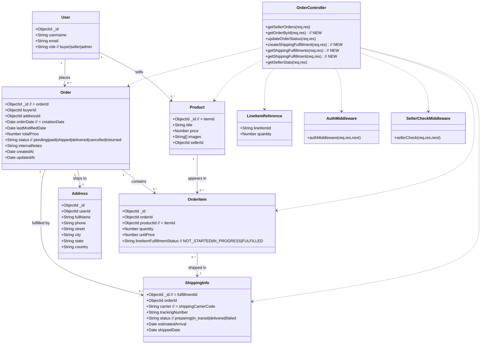
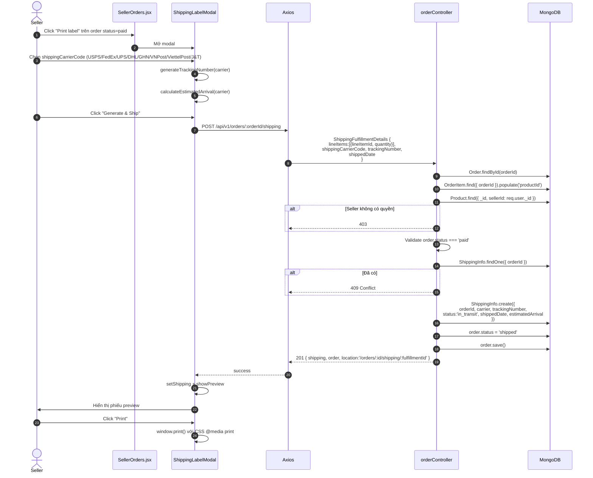
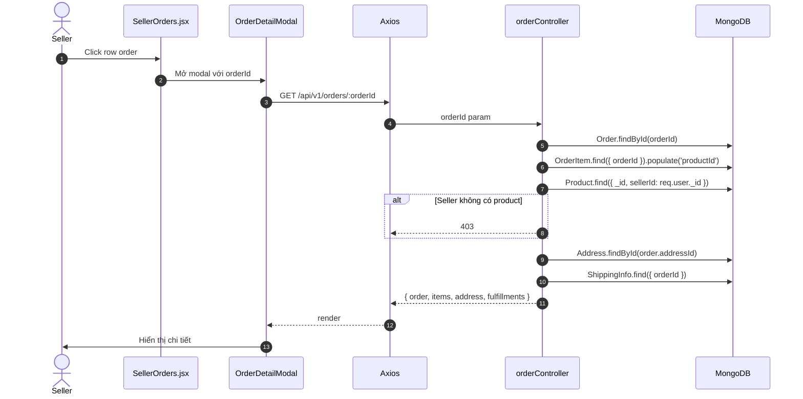
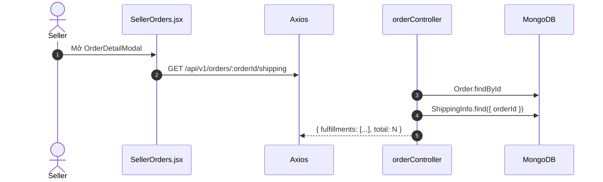

# Order Fulfillment - Thiết kế theo eBay Fulfillment API

> File này suy ngược thiết kế từ tài liệu eBay chính thức: `docs/plan/fulfillment_api.json` + `docs/plan/sell_feed_v1_oas3.json` + `docs/plan/order.md` (status plan).
> Stack: Node.js / Express / Mongoose (back-end) + React (front-end).
> Mục tiêu: ánh xạ nghiệp vụ eBay Seller về hệ thống clone, bám sát code thật.

## 1. Mục lục

1. [Domain model từ eBay Fulfillment API](#1-domain-model-từ-ebay-fulfillment-api)
2. [Ánh xạ eBay → hệ thống hiện tại](#2-ánh-xạ-ebay--hệ-thống-hiện-tại)
3. [Endpoints (mirror eBay)](#3-endpoints-mirror-ebay)
4. [Status enum chuẩn eBay](#4-status-enum-chuẩn-ebay)
5. [Class Diagram](#5-class-diagram)
6. [Sequence Diagram](#6-sequence-diagram)

---

## 1. Domain model từ eBay Fulfillment API

Từ schema của eBay, các entity chính:

### 1.1 Order (eBay `Order`)

| Field eBay | Type | Mô tả |
|------------|------|-------|
| `orderId` | string | Unique ID (e.g. `01-03955-36441`) |
| `buyer` | Buyer | { username } |
| `sellerId` | string | Seller user ID |
| `creationDate` | ISO 8601 | |
| `lastModifiedDate` | ISO 8601 | |
| `orderFulfillmentStatus` | enum | `NOT_STARTED \| IN_PROGRESS \| FULFILLED` |
| `orderPaymentStatus` | enum | `PENDING \| PAID \| REFUNDED \| FAILED \| PARTIALLY_REFUNDED \| FULLY_REFUNDED` (xem OrderPaymentStatusEnum) |
| `cancelStatus` | CancelStatus | { cancelState, cancelRequests[], cancelledDate } |
| `lineItems` | LineItem[] | |
| `fulfillmentStartInstructions` | FulfillmentStartInstruction[] | carrier, service, shipTo (template từ buyer/seller preference) |
| `fulfillmentHrefs` | string[] | URI để get fulfillments của order |
| `paymentSummary` | PaymentSummary | |
| `pricingSummary` | PricingSummary | |
| `buyerCheckoutNotes` | string | |
| `totalFeeBasisAmount` | Amount | |
| `program` | Program | (Authenticity Guarantee, optional) |

### 1.2 LineItem (eBay `LineItem`)

| Field | Type | Mô tả |
|-------|------|-------|
| `lineItemId` | string | Unique ID của line item |
| `itemId` / `legacyItemId` | string | Listing ID |
| `title` | string | |
| `quantity` | int | |
| `lineItemCost` | Amount | |
| `deliveryCost` | Amount | |
| `taxes` | Tax[] | |
| `lineItemFulfillmentStatus` | enum | `FULFILLED \| IN_PROGRESS \| NOT_STARTED` |
| `lineItemFulfillmentInstructions` | FulfillmentStartInstruction | |
| `soldFormat` | enum | `AUCTION \| FIXED_PRICE` |
| `refunds` | LineItemRefund[] | |

### 1.3 ShippingFulfillment (eBay)

| Field | Type | Mô tả |
|-------|------|-------|
| `fulfillmentId` | string | Unique ID (eBay-generated, hoặc = trackingNumber nếu cung cấp) |
| `lineItems` | LineItemReference[] | [{ lineItemId, quantity }] |
| `shippedDate` | ISO 8601 | |
| `shippingCarrierCode` | string | eBay carrier code (e.g. `USPS`, `FedEx`, `UPS`) |
| `shipmentTrackingNumber` | string | |

**Đặc điểm quan trọng từ eBay**:
- 1 Order có thể có **nhiều ShippingFulfillment** (1 line item cũng có thể tách nhiều package).
- Mỗi fulfillment thuộc 1 order, link tới 1+ lineItem qua `lineItemId`.
- `fulfillmentId` nếu có `trackingNumber` thì = trackingNumber; nếu không thì eBay gán tự động (e.g. `999`).
- `trackingNumber` chỉ chấp nhận alphanumeric (không space, không hyphen).

### 1.4 CancelStatus (eBay)

| Field | Type | Mô tả |
|-------|------|-------|
| `cancelState` | enum | `NONE_REQUESTED \| IN_PROGRESS \| CANCELED` |
| `cancelRequests` | CancelRequest[] | Mảng các yêu cầu huỷ |
| `cancelledDate` | ISO 8601 | Ngày huỷ (nếu đã huỷ) |

`CancelRequest` gồm: `cancelCompletedDate`, `cancelRequestedDate`, `cancelRequestId`, `cancelRequestState` (e.g. `NONE_REQUESTED`, `CANCEL_REQUESTED`, `CANCEL_CLOSED`, `CANCEL_DECLINED`).

### 1.5 OrderFulfillmentStatus enum

- `NOT_STARTED`: chưa ship gì cả.
- `IN_PROGRESS`: order có nhiều line items, đã ship 1 số nhưng chưa hết.
- `FULFILLED`: toàn bộ line items đã ship.

**Lưu ý**: eBay dùng `lineItemFulfillmentStatus` cho từng line item riêng. Khi 1 line item có bất kỳ quantity nào được fulfill → line item đó = `FULFILLED`.

### 1.6 OrderPaymentStatus enum (eBay OrderPaymentStatusEnum)

`PENDING`, `PAID`, `REFUNDED`, `FAILED`, `PARTIALLY_REFUNDED`, `FULLY_REFUNDED` (chi tiết cần verify khi dùng).

### 1.7 CancelStateEnum

`NONE_REQUESTED`, `IN_PROGRESS`, `CANCELED`.

---

## 2. Ánh xạ eBay → hệ thống hiện tại

### 2.1 Bảng ánh xạ entity

| eBay entity | Model hiện tại | Thiếu / cần thêm |
|-------------|---------------|------------------|
| `Order` | `Order.js` (6 field) | Thiếu: `orderId` (đang dùng `_id`), `orderFulfillmentStatus`, `orderPaymentStatus`, `cancelStatus`, `lastModifiedDate`, `fulfillmentStartInstructions` snapshot |
| `LineItem` | `OrderItem.js` (4 field) | OK — `productId` = `itemId`, cần thêm `lineItemFulfillmentStatus` |
| `ShippingFulfillment` | `ShippingInfo.js` (6 field) | OK — `orderId, carrier, trackingNumber, status, estimatedArrival`. **Cần đổi `carrier` → `shippingCarrierCode` (chữ thường), bổ sung `lineItems[]` reference (thay vì 1 orderId duy nhất), bổ sung `shippedDate`** |
| `Buyer` | `User.js` | OK — dùng `username/email` |
| `CancelStatus` | **CHƯA CÓ** | Cần tạo: embedded vào Order |

### 2.2 Bảng ánh xạ status

| eBay | Code hiện tại (`Order.status`) | Ghi chú |
|------|-------------------------------|---------|
| `orderPaymentStatus: PENDING` | `pending` | OK |
| `orderPaymentStatus: PAID` | `paid` | OK |
| `orderFulfillmentStatus: NOT_STARTED` | (chưa có) | Cần thêm field `fulfillmentStatus` |
| `orderFulfillmentStatus: IN_PROGRESS` | (chưa có) | |
| `orderFulfillmentStatus: FULFILLED` | `shipped` | OK (sau khi ship) |
| `orderPaymentStatus: REFUNDED/FULLY_REFUNDED` | `returned`? | Dùng `returned` cho cả return lẫn refund, hoặc tách |
| `cancelState: CANCELED` | `cancelled` | OK |
| `cancelState: IN_PROGRESS` | (chưa có) | Cần thêm `cancelStatus.cancelState` |

**Đề xuất thiết kế mới (đơn giản, YAGNI)**:

1. Giữ `Order.status` cho 2 trục tách biệt:
   - `paymentStatus`: `pending \| paid \| refunded` (enum, ref eBay)
   - `fulfillmentStatus`: `not_started \| in_progress \| fulfilled` (enum, ref eBay)
   - `cancelState`: `none \| in_progress \| cancelled` (ref eBay)
2. Bỏ `Order.status` cũ (gộp 3 trục), map:
   - `pending` → `paymentStatus=pending`
   - `paid` → `paymentStatus=paid, fulfillmentStatus=not_started`
   - `shipped` (một phần) → `fulfillmentStatus=in_progress`
   - `shipped` (toàn bộ) → `fulfillmentStatus=fulfilled`
   - `cancelled` → `cancelState=cancelled`
   - `returned` → `fulfillmentStatus=fulfilled, paymentStatus=refunded` (hoặc thêm `refunded` status)
3. Hoặc giữ code cũ + thêm 1 field `fulfillmentStatus` (đỡ phá vỡ code hiện tại).

**Khuyến nghị cuối**: **Giữ `Order.status` cũ + thêm `fulfillmentStatus` enum riêng** (YAGNI, ít phá code).

### 2.3 Bảng ánh xạ endpoint

| eBay endpoint | Hệ thống hiện tại | Mapping đề xuất |
|---------------|-------------------|------------------|
| `GET /sell/fulfillment/v1/order/{orderId}` | **CHƯA CÓ** | Thêm `GET /api/v1/orders/:orderId` |
| `GET /sell/fulfillment/v1/order?filter=...` | `GET /api/v1/orders` (`getSellerOrders`) | OK, mở rộng filter theo eBay |
| `GET /sell/fulfillment/v1/order/{orderId}/shipping_fulfillment` | **CHƯA CÓ** | Thêm `GET /api/v1/orders/:orderId/shipping` |
| `POST /sell/fulfillment/v1/order/{orderId}/shipping_fulfillment` | **CHƯA CÓ** | Thêm `POST /api/v1/orders/:orderId/shipping` |
| `GET /sell/fulfillment/v1/order/{orderId}/shipping_fulfillment/{fulfillmentId}` | **CHƯA CÓ** | Thêm `GET /api/v1/orders/:orderId/shipping/:fulfillmentId` |
| (eBay không expose PATCH order) | `PATCH /api/v1/orders/:orderId/status` | Khác eBay: tự quản lý transition (vì clone) |
| `GET /sell/fulfillment/v1/order/{order_id}/issue_refund` | **CHƯA CÓ** | YAGNI, bỏ |
| Feed API (order_task) | **CHƯA CÓ** | YAGNI, bỏ |

---

## 3. Endpoints (mirror eBay)

Tất cả endpoint dưới `auth + sellerCheck` (giống code hiện tại).

| Method | Path | Controller | Mô tả |
|--------|------|------------|-------|
| GET | `/api/v1/orders` | `getSellerOrders` | List orders của seller, hỗ trợ filter `creationdate`, `orderfulfillmentstatus`, pagination |
| GET | `/api/v1/orders/:orderId` | `getOrderById` | Chi tiết 1 order (mirror eBay `getOrder`) |
| POST | `/api/v1/orders/:orderId/shipping` | `createShippingFulfillment` | Tạo fulfillment (mirror eBay) |
| GET | `/api/v1/orders/:orderId/shipping` | `getShippingFulfillments` | List fulfillments của order |
| GET | `/api/v1/orders/:orderId/shipping/:fulfillmentId` | `getShippingFulfillment` | Chi tiết 1 fulfillment |
| PATCH | `/api/v1/orders/:orderId/status` | `updateOrderStatus` | Update `Order.status` (clone-specific, không có trong eBay API public) |
| GET | `/api/v1/orders/stats` | `getSellerStats` | Thống kê (giữ nguyên) |

**Lưu ý**: eBay dùng RESTful style riêng. Mình giữ endpoint `/shipping` thay vì `/shipping_fulfillment` cho gọn (YAGNI, internal API).

---

## 4. Status enum chuẩn eBay

Áp dụng vào hệ thống:

### 4.1 `Order.status` (giữ nguyên, đơn giản)

`pending \| paid \| shipped \| delivered \| cancelled \| returned` (6 trạng thái — đã có, không mở rộng để tránh migration).

**Mapping nội bộ tới eBay**:
| Code | eBay fulfillmentStatus | eBay paymentStatus | eBay cancelState |
|------|------------------------|--------------------|--------------------|
| `pending` | `NOT_STARTED` | `PENDING` | `NONE_REQUESTED` |
| `paid` | `NOT_STARTED` | `PAID` | `NONE_REQUESTED` |
| `shipped` | `FULFILLED` (giả định) | `PAID` | `NONE_REQUESTED` |
| `delivered` | `FULFILLED` | `PAID` | `NONE_REQUESTED` |
| `cancelled` | (n/a) | (n/a) | `CANCELED` |
| `returned` | `FULFILLED` | `REFUNDED` | `NONE_REQUESTED` |

### 4.2 `ShippingInfo.status`

`preparing \| in_transit \| delivered \| failed` (4 trạng thái — đã có, OK).

### 4.3 `ShippingInfo.shippingCarrierCode`

Cập nhật field name từ `carrier` → `shippingCarrierCode` (khớp eBay). Trong code hiện tại, đang dùng `carrier` — đề xuất **giữ tên `carrier`** cho internal đỡ phá (YAGNI), nhưng document mapping.

### 4.4 eBay CancelStateEnum

YAGNI — không cần thiết kế cancel flow trong scope này. Giữ `cancelled` đơn giản.

---

## 5. Class Diagram



**Khác biệt so với code hiện tại**:
- Hiện tại `ShippingInfo` không có reference ngược tới `OrderItem` (chỉ `orderId`). Theo eBay, mỗi fulfillment chứa `lineItems[]` — cần quyết định:
  - **Option A** (YAGNI): giữ `ShippingInfo.orderId` đơn giản. Coi 1 order = 1 fulfillment (giống code hiện tại).
  - **Option B** (chuẩn eBay): `ShippingInfo` không có `orderId` (vì eBay endpoint lồng trong order), thay vào đó có `lineItems[]` reference, lưu trong OrderItem hoặc một mapping table riêng.
  - **Khuyến nghị**: chọn **A** cho scope này (YAGNI, đỡ phá code). Mở rộng sau nếu có multi-package.

---

## 6. Sequence Diagram

### 6.1 UC-03: Tạo shipping fulfillment (mirror eBay `createShippingFulfillment`)



### 6.2 UC-04: Mark delivered

```mermaid
sequenceDiagram
  autonumber
  actor S as Seller
  participant FE as SellerOrders.jsx
  participant AX as Axios
  participant BE as orderController
  participant DB as MongoDB

  S->>FE: Click "Mark delivered" trên order status=shipped
  FE->>AX: PATCH /api/v1/orders/:orderId/status
  AX->>BE: { status: 'delivered' }
  BE->>DB: Order.findById
  BE->>DB: OrderItem + Product verify seller
  BE->>BE: Validate transition shipped → delivered
  BE->>DB: order.status = 'delivered'; order.save()
  BE->>DB: ShippingInfo.updateOne({ orderId }, { status: 'delivered' })
  BE-->>AX: order updated
  AX-->>FE: refresh list
```

### 6.3 UC-05: Mark delivery failed (eBay: ghi nhận + refund request)

```mermaid
sequenceDiagram
  autonumber
  actor S as Seller
  participant FE as SellerOrders.jsx
  participant Modal as DeliveryFailModal
  participant AX as Axios
  participant BE as orderController
  participant DB as MongoDB

  S->>FE: Click "Mark failed" trên order status=shipped
  FE->>Modal: Mở modal nhập lý do
  S->>Modal: Nhập reason, submit
  Modal->>AX: PATCH /api/v1/orders/:orderId/status
  AX->>BE: { status: 'returned', internalNotes: reason }
  BE->>DB: Order.findById
  BE->>DB: OrderItem + Product verify seller
  BE->>BE: Validate shipped → returned
  BE->>DB: order.status = 'returned'; order.internalNotes = reason; order.save()
  BE->>DB: ShippingInfo.updateOne({ orderId }, { status: 'failed' })
  BE-->>AX: order updated
  AX-->>Modal: success + close
```

### 6.4 UC-02: Get order detail (mirror eBay `getOrder`)



### 6.5 List fulfillments (mirror eBay `getShippingFulfillments`)



---

## 7. Kết luận thiết kế

### Thiết kế chốt (YAGNI)

1. **Giữ nguyên model hiện tại** (`Order`, `OrderItem`, `ShippingInfo`, `Address`):
   - `Order.status` giữ 6 enum cũ (đỡ migration).
   - `ShippingInfo` giữ cấu trúc phẳng (1 order = 1 fulfillment max).
2. **Thêm endpoint mới** (mirror eBay):
   - `GET /api/v1/orders/:orderId` — chi tiết order.
   - `GET /api/v1/orders/:orderId/shipping` — list fulfillments.
   - `GET /api/v1/orders/:orderId/shipping/:fulfillmentId` — 1 fulfillment.
   - `POST /api/v1/orders/:orderId/shipping` — tạo fulfillment (UC-03).
3. **Sửa endpoint hiện có**:
   - `PATCH /api/v1/orders/:orderId/status` — thêm validate transition whitelist (UC-04, UC-05), nhận `internalNotes`.
4. **Bổ sung field nhỏ** (không phá):
   - `Order.internalNotes: String` (YAGNI — không thêm `cancelStatus`, `orderFulfillmentStatus`, `lineItemFulfillmentStatus` vì phá scope).

### Phạm vi KHÔNG triển khai (YAGNI)

- eBay `issue_refund` (refund flow).
- eBay `payment_dispute`.
- eBay `order_task` (Feed API download reports).
- Multi-package fulfillment (1 order = nhiều package).
- `lineItemFulfillmentStatus` riêng.
- `cancelStatus` nested object.
- `fulfillmentStartInstructions` snapshot.

### Nguồn tham chiếu

- `docs/plan/fulfillment_api.json` — eBay Fulfillment API v1
- `docs/plan/sell_feed_v1_oas3.json` — eBay Feed API
- `docs/plan/order.md` — Status plan note
- `docs/order-management.md` — Plan tổng (đã cập nhật)
